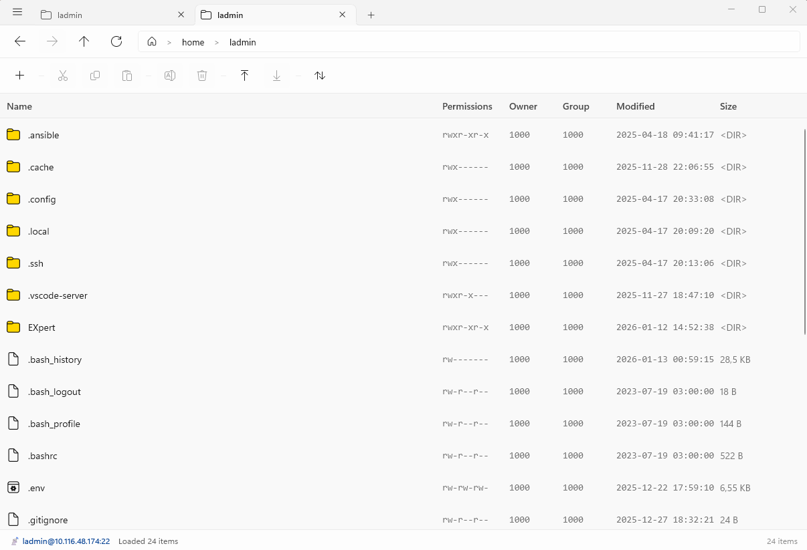
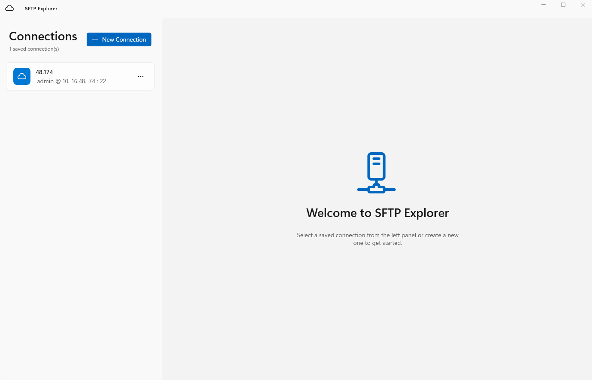

# SFTP Explorer

A modern, fast **SFTP client for Windows 11** built with [WinUI 3](https://github.com/microsoft/winui) and [.NET 10](https://dotnet.microsoft.com/). It combines a fluent file manager with an integrated SSH terminal, drag-and-drop transfers, and solid security practices — all in a native-feeling Windows app.

| | |
|---|---|
| **Platform** | Windows 11 (x64 & ARM64) |
| **UI framework** | WinUI 3 / Windows App SDK |
| **SSH/SFTP stack** | [SSH.NET](https://github.com/sshnet/SSH.NET) |
| **Terminal** | Microsoft Terminal control (WinUI 3 port) |
| **Languages** | English, Русский |
| **License** | [GPL-3.0](LICENSE) |

## Screenshots

| Main window — connections panel, file browser and terminal | Start screen with saved connection groups |
|---|---|
|  |  |

## Features

### File management
- **Tabbed interface** — work with several servers at once; each tab keeps its own session, history and terminal.
- **Drag & drop transfers** — drag files or folders from Windows Explorer onto the remote tree (and back), with per-file progress, retry/skip on errors and cancellation support.
- **Full clipboard operations** — cut, copy, paste, rename and delete for both files and directories.
- **Create new files and folders** directly on the server.
- **Navigation history** — back/forward/up buttons plus an address bar with live path suggestions (with caching).
- **Free-space column** — per-filesystem disk usage statistics, toggleable in one click.
- **Owner & group resolution** — numeric UID/GID are resolved to human-readable names when the server supports it.
- **Open local files for editing** with automatic re-upload: a file watcher detects local changes and syncs them back to the remote path (with retry on busy files).

### Integrated SSH terminal
- Full interactive shell embedded in each tab, powered by a WinUI 3 port of the Microsoft Terminal control.
- Command history, output scrolling buffer, maximize mode, and saving terminal output to a file.
- **Run scripts** — right-click any `.sh`/script file on the server to execute it (optionally via `sudo`).

### Connections & security
- **Saved connections with groups** — organize servers into groups; customize icons and colors for both connections and groups, add notes.
- **Password or SSH private key authentication**, including encrypted keys with passphrases.
- **Credentials are stored in Windows Credential Manager** (DPAPI) — never in plain text on disk.
- **Host-key verification** — known host keys are remembered with their SHA-256 fingerprint; a changed host key blocks the connection and shows an explicit security warning to protect against man-in-the-middle attacks.
- **`sudo` browsing** — open directories or files that require elevated permissions on the server (passwordless `sudo -n`).
- **`sftp://` protocol handler** — click an `sftp://user@host/path` link in a browser and SFTP Explorer opens the connection for you.

### Platform polish
- Native Windows 11 look: Mica backdrop, custom title bar with document tabs, light/dark theme support.
- Localized interface (English / Russian).
- Packaged as MSIX; available for x64 and ARM64.

## Requirements

- **Windows 11** (build 22000 or later) — x64 or ARM64.

## Installation

The app is distributed through the **Microsoft Store**. Alternatively, you can build the MSIX package yourself (see below) and install it with `Add-AppxPackage`.

> Note: the package requires the `runFullTrust` capability to work with local files and Windows Credential Manager.

## Building from source

### Prerequisites
- Windows 10/11 with Visual Studio 2022 (17.10+) or the **.NET 10 SDK**
- Workload: **Desktop development with C#** + **Windows App SDK** support

### Build
```powershell
dotnet build SftpExplorerWinUI.csproj -c Release
```

### Publish an MSIX package
```powershell
dotnet publish SftpExplorerWinUI.csproj -c Release -p:Platform=x64
# or for ARM64:
dotnet publish SftpExplorerWinUI.csproj -c Release -p:Platform=ARM64
```

The resulting `.msix` / store-upload package is produced under `AppPackages/`.

## Running the tests

The test project (`SftpExplorer.Tests`) targets plain .NET 10 and runs on any OS. It contains unit tests plus integration tests that run against a disposable SFTP server (the CI pipeline spins one up from a pinned [`atmoz/sftp`](https://hub.docker.com/r/atmoz/sftp) image).

```powershell
# Unit tests only:
dotnet test SftpExplorer.Tests/SftpExplorer.Tests.csproj -c Release

# With the live-SFTP integration suite (requires a reachable SFTP server):
$env:SFTP_TEST_ENABLED = "1"
$env:SFTP_TEST_HOST = "127.0.0.1"
$env:SFTP_TEST_PORT = "2222"
$env:SFTP_TEST_USERNAME = "test"
$env:SFTP_TEST_PASSWORD = "password"
$env:SFTP_TEST_WRITABLE_PATH = "/upload"
$env:SFTP_TEST_HOST_KEY_SHA256 = "<fingerprint>"
dotnet test SftpExplorer.Tests/SftpExplorer.Tests.csproj -c Release
```

CI runs on Azure Pipelines (`.NET 10`, Ubuntu 24.04) with TRX results and Cobertura code coverage.

## Project structure

```
├── App.xaml / App.xaml.cs          # Application entry point, sftp:// URL handling
├── MainWindow.xaml(.cs)            # Main window: tabs, title bar, connection orchestration
├── SftpTabContent.xaml(.cs)        # Per-tab file browser + terminal (core of the app)
├── SftpConnectionDialog.xaml(.cs)  # New/edit connection dialog with live connection test
├── Controls/                       # Reusable UI controls (connections panel, pickers…)
├── Models/                         # SavedConnection, group settings
├── Services/                       # Connection manager, credential & host-key stores,
│                                   #   SSH client factory, terminal connection, file locks…
├── Helpers/                        # Localization and other helpers
├── Strings/en-US|ru-RU/            # Localized resources (.resw)
├── Microsoft.Terminal.WinUI3/             # Git submodule: WinUI 3 port of the Microsoft Terminal control
└── SftpExplorer.Tests/             # xUnit unit + integration tests
```

## Security notes

- Passwords and key passphrases are stored only in **Windows Credential Manager** (per-user, DPAPI-protected). Connection metadata lives in a JSON file that is written atomically under an inter-process lock.
- The app performs **TOFU host-key pinning**: the first fingerprint you accept is remembered; any later mismatch aborts the connection with a detailed warning showing both fingerprints.
- Remote uploads use staging + backup transactions so interrupted transfers do not corrupt existing files.

## License

This project is licensed under the [GNU General Public License v3.0](LICENSE).

---

Made with ❤️ for Windows 11 — feedback and contributions are welcome!
